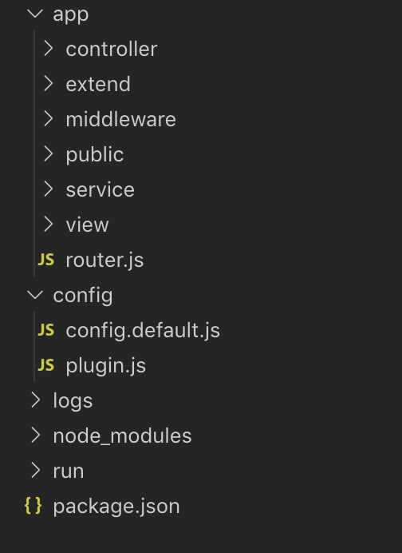

## QCEggTest
测试了一下阿里封装的egg.js,自己按照官方文档写了个demo.<br/>
An easy-to-use project of [egg](https://eggjs.org/zh-cn/intro/quickstart.html), a web application framework for Node.



## structure
```
其中最重要的一块儿是app里边的内容：
controller ：里边是egg封装好的控制器
extend     ：过滤器我们放在这里，类似于vue里边的过滤器
middleware ：放一些中间件，应用里的中间件需要在config.defailt.js中注册和配置一下
public     ：静态文件
service    ：db层，主要是为控制层提供数据
view       ：前端插件，注意在config/plugin.js中注册一下
```

## how to use
pull下代码之后：
cnpm i<br/>
然后我又用了一个moment，so：<br/>
cnpm i moment 
